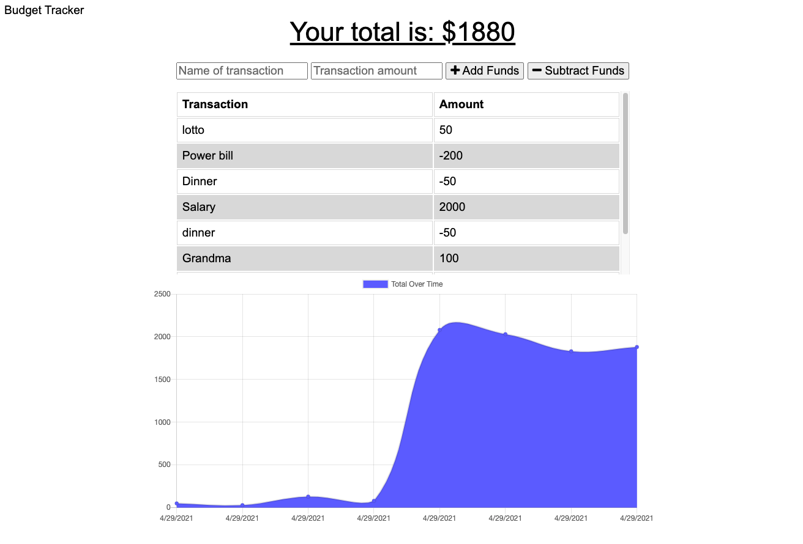

# budget-tracker

# Description
Budget Tracker is a progressive web application updated with offline access and functionality. Users can add expenses and deposits to their budget whether or not they are connected to the internet. If they go offline, their transactions will be updated once they regain connection. This application uses IndexedDb, service workers, and can also be downloaded as an app to the users home screen. Node.js, Mongoose.js, Express.js, MongoDb, morgan, and compression were used to build this app. Check out the live site hosted by heroku [here](https://evening-basin-48189.herokuapp.com/).

# Table of Contents
- [Installation](#installation)
- [Usage](#usage)
- [License](#license)
- [Contributing](#contributing)
- [Tests](#tests)
- [Questions](#questions)

# Installation
After cloning the code run `npm install` in the root of the project in the command line. You must have MongoDB installed on your computer to run the application. After running `npm install` run `npm start` to start the server.

# Usage
The live application can be found [here](https://evening-basin-48189.herokuapp.com/).

# License
This project is covered by the [MIT](https://spdx.org/licenses/MIT.html) license.

# Contributing
Michael Humpherys

# Tests
Currently there are no tests for this application.

# Questions
Feel free to contact me with any questions at my email or GitHub. [Email](mailto:mrhumpherys@gmail.com), [GitHub](https://github.com/mrhumpherys)